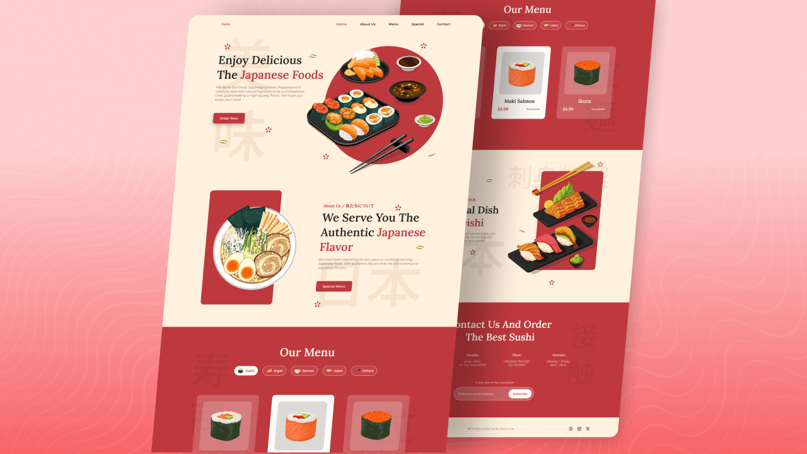

# 🍣 Sushi Rush

> Responsive sushi restaurant website built following **Bedimcode**'s tutorial.  
> Vanilla HTML/CSS/JS, Swiper menu tabs, ScrollReveal animations, mobile-first navigation.  
> Fresh code, fresher sushi.

<p align="center">
  
  
  
  
  
</p>

---

## 📸 Preview

<p align="center">
  
</p>

---

## ✨ Features

- **Fully Responsive** — mobile-first, modern range syntax: `<=320px`, `>=540px`, `<=1150px`, `>=1150px`, `>=2048px` (2K via `zoom: 120%`)
- **Swiper Menu** — tab slider + content slider synced via `thumbs`, `loop: true` (see `main.js` → `swiperTabs` / `SwiperMenu`)
- **ScrollReveal Animations** — `origin: bottom, distance: 60px, duration: 1500`, per-section reveals (`main.js` → `sr.reveal`)
- **Scroll-Up Button** — appears after 350px of scroll
- **Active Nav Links** — menu item highlights as you scroll through sections
- **Mobile Hamburger Menu** — slide-in nav, auto-closes on link click
- **Scroll Header** — shadow (`.scroll-header`) appears after 50px of scroll
- **Contact + Newsletter** — order section with socials, address/phones, subscribe form
- **Full Footer** — logo, socials, copyright
- **CSS Custom Properties** — full theme in `:root` (`styles.css`), type scale grows at `>=1150px`
- **Vanilla Stack** — zero frameworks, no build step
- **Japanese Details** — kanji headings, sakura & leaf SVG ornaments reused across sections

---

## 🍱 Sections & Content

| Section | Anchor | What's inside (`index.html`) |
|---------|--------|------------------------------|
| Home | `#home` | Hero title, description, Order CTA, 6 dish images, kanji 美味 |
| About | `#about` | Subtitle + title, 10-years story text, Special Menu CTA, photo |
| Menu | `#menu` | 5 tab categories × 3 dishes: Sushi, Nigiri, Ramen, Udon, Others (demo prices) |
| Special | `#new` | Sashimi Oishi spotlight, description, 5 images |
| Contact | `#contact` | Order CTA, address/phones, Messenger/WhatsApp/mail links, newsletter form |

Plus: slide-in header nav, footer, scroll-up button.

---

## 🛠 Tech Stack

| Technology | Version / Details | Where |
|------------|-------------------|-------|
| HTML5 | Semantic markup | `index.html` |
| CSS3 | Custom properties, Grid, Flexbox, transitions | `assets/css/styles.css` |
| JavaScript (ES6+) | DOM, Swiper, ScrollReveal, menu/scroll logic | `assets/js/main.js` |
| [Swiper](https://swiperjs.com/) | 12 via jsDelivr | Menu `tabs` + `content` sliders |
| [ScrollReveal](https://scrollrevealjs.org/) | 4.0.0 via unpkg | `sr = ScrollReveal({...})` in `main.js` |
| [Remixicon](https://remixicon.com/) | 4.6.0 via cdnjs | Menu, contact, footer, scroll-up icons |
| [Google Fonts](https://fonts.google.com/) | Montserrat + Lora, via `@import` in CSS | `--body-font`, `--second-font` |

---

## 🚀 Quick Start

```bash
# Clone the repo
git clone https://github.com/h1chan/Sushi-Rush.git
cd Sushi-Rush

# Open index.html in browser
# (or run Live Server in VS Code)
```

No `npm install`, `build`, or dependencies — pure frontend.

---

## 📁 Project Structure

```
Sushi-Rush/
├── index.html           # Entry point (Home · About · Menu · Special · Contact)
├── assets/
│   ├── css/
│   │   └── styles.css   # All styles (~1310 lines)
│   ├── js/
│   │   └── main.js      # Menu, Swiper, reveal, scroll (~128 lines)
│   └── img/             # Dishes (home/menu/new), decor SVGs, favicon, preview
└── README.md
```

---

## 🎨 Customization

| What to change | Where to look |
|----------------|---------------|
| Brand colors | `:root` in `styles.css` (`--first-color`, `--body-color`, `--container-color`...) |
| Fonts | `@import` at top of `styles.css` + `--body-font`, `--second-font` |
| Dishes & prices | `index.html` → `menu__card` blocks (name / price / stock) |
| Menu tabs slider | `main.js` → `swiperTabs` + `SwiperMenu` (thumbs sync, `loop`) |
| Scroll animations | `main.js` → `ScrollReveal({...})` + `sr.reveal(...)` per section |
| Scroll-up trigger | `main.js` → `scrollUp` (`scrollY >= 350`) |
| Active link offset | `main.js` → `scrollActive` (`offsetTop - 50`) |
| Header shadow trigger | `main.js` → `scrollHeader` (`scrollY >= 50`) |
| Newsletter form | `index.html` → `contact__form` (input + button) |
| Footer copy | `index.html` → `footer__copy` |
| Mobile menu breakpoint | `styles.css` → `@media (width <= 1150px)` (`.nav__menu`) |
| Type scale | `styles.css` → `@media (width >= 1150px)` (`:root` font sizes) |

---

## 📱 Responsive Breakpoints

```css
/* Mobile First, range syntax → */
@media screen and (width <= 320px)  { /* Small phones: blob + kanji scale-down */ }
@media screen and (width >= 540px)  { /* Grids lock to 400px centered columns */ }
@media screen and (width <= 1150px) { /* Tablet / mobile slide-in menu */ }
@media screen and (width >= 1150px) { /* Desktop layout + larger type scale */ }
@media screen and (width >= 2048px) { /* 2K: body zoom 120% */ }
```

---

## 🙏 Credits

Built following [Bedimcode](https://www.youtube.com/@Bedimcode)'s  
**"Responsive Sushi Website"** tutorial on YouTube.

🎬 [Watch the Demo & Code](https://youtu.be/fnjpiX4QYzo)

Original design & tutorial by Bedimcode — thank you for the amazing content!

---

## 📄 License

[MIT License](LICENSE) — free to use, modify, distribute.  
Keep a copy of the license when forking.

---

## 👤 Author

h1chan — [GitHub](https://github.com/h1chan) · [Discord](https://discord.com/users/1064052965247295518)

---

<p align="center">
  Made with 🍣 and vanilla JS
</p>
